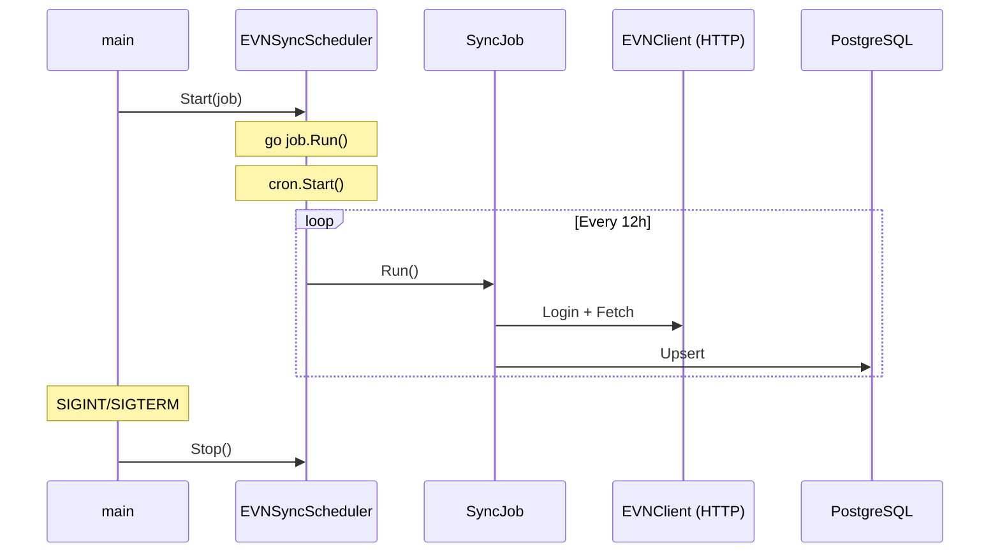

# Volt

Volt is a Go-based backend application designed to collect electricity consumption data from the EVNHCMC customer portal, store daily usage records in PostgreSQL, calculate tier-based electricity billing costs (with VAT), and send alerts via Telegram.

> [!CAUTION]
> This project is intended for personal and educational use only.
>
> The project is not affiliated with, endorsed by, or associated with EVNHCMC or any government entity.

---

## Architecture

```text
                    GitHub Actions / External Cron
                         +----------------+
                         |  Cron Worker   |
                         +-------+--------+
                                 |
                                 v
                       Volt API (Go Server)
                                 |
             +-------------------+-------------------+
             v                                       v
      EVNHCMC Portal                            PostgreSQL
             |                                       |
             +-------------------+-------------------+
                                 |
                                 v
                     Business & Billing Engine
                         (Tier Calculation)
                                 |
                                 v
                            Telegram Bot
```

### Data Sync Flow (Cron Job — every 12h)

The application runs an **in-process cron job** (`0 */12 * * *`) powered by `robfig/cron`. On each trigger (and immediately on startup), it executes the following sequence:



---

### Tech Stack & Features

| Component       | Technology                                                  | Description                                                 |
|-----------------|-------------------------------------------------------------|-------------------------------------------------------------|
| **Runtime**     | [Go](https://go.dev/)                                       | Backend logic                                               |
| **Database**    | [PostgreSQL](https://www.postgresql.org/)                   | Storage for electricity consumption history                 |
| **Live Reload** | [Air](https://github.com/air-verse/air)                     | Hot reloading during local development                      |
| **Environment** | [direnv](https://direnv.net/)                               | Automatic environment variable management                   |
| **Logging**     | [Zap](https://github.com/uber-go/zap)                       | High-performance logging                                    |
| **Telegram**    | [Telegram Bot](https://core.telegram.org/bots)              | Real-time electricity consumption alerts                    |
| **Cron**        | [Cron](https://github.com/robfig/cron)                      | Scheduled jobs                                              |

---

## Development & Environment Setup

### Prerequisites

- Go 1.22+
- PostgreSQL database
- [direnv](https://direnv.net/) (optional)
- [Air](https://github.com/air-verse/air) (optional)

### Environment Configuration

1. Copy `.env.example` to `.env`:

   ```bash
   cp .env.example .env
   ```

2. Fill in your environment parameters:

    ```bash
    export EVN_USERNAME="your_username"
    export EVN_PASSWORD="your_password"
    export EVN_CUSTOMER_CODE="your_customer_code"
    
    export TELEGRAM_API_KEY=""
    ```

3. Load variables:

   ```bash
   source .env
   ```

### Running Locally

Run with live reloading using Air:

```bash
air
```

### Running Tests

Execute unit tests:

```bash
go test ./...
```

---

## License

MIT
