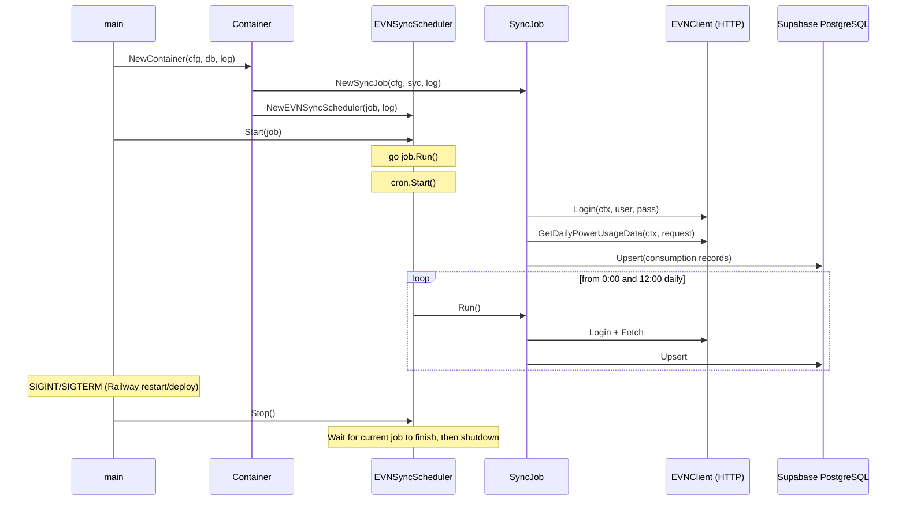

# Volt

Volt is a Go-based backend application designed to collect electricity consumption data from the EVNHCMC customer portal, store daily usage records in PostgreSQL, calculate tier-based electricity billing costs (with VAT), and send alerts via Telegram.

> [!CAUTION]
> This project is intended for personal and educational use only.
>
> The project is not affiliated with, endorsed by, or associated with EVNHCMC or any government entity.

---

## Architecture

```text
                    GitHub Actions / External Cron
                         +----------------+
                         |  Cron Worker   |
                         +-------+--------+
                                 |
                                 v
                       Volt API (Go Server)
                                 |
             +-------------------+-------------------+
             v                                       v
      EVNHCMC Portal                       PostgreSQL (Supabase)
    (HTTP Multipart API)                   (Electricity Storage)
             |                                       |
             +-------------------+-------------------+
                                 |
                                 v
                     Business & Billing Engine
                         (Tier Calculation)
                                 |
                                 v
                            Telegram Bot
```

### Data Sync Flow (Cron Job — every 12h)

The application runs an **in-process cron job** (`0 */12 * * *`) powered by `robfig/cron`. On each trigger (and immediately on startup), it executes the following sequence:



---

### Tech Stack & Features

| Component       | Technology                                                  | Description                                                 |
|-----------------|-------------------------------------------------------------|-------------------------------------------------------------|
| **Runtime**     | [Go](https://go.dev/)                                       | HTTP server & business logic                                |
| **Router**      | [Chi](https://github.com/go-chi/chi)                        | High-performance HTTP router                                |
| **Database**    | [PostgreSQL](https://www.postgresql.org/)                   | Storage for electricity consumption history                 |
| **Live Reload** | [Air](https://github.com/air-verse/air)                     | Hot reloading during local development                      |
| **Environment** | [direnv](https://direnv.net/)                               | Automatic environment variable management                   |
| **Migrations**  | [golang-migrate](https://github.com/golang-migrate/migrate) | Database migration management                               |
| **Logging**     | [Zap](https://github.com/uber-go/zap)                       | High-performance logging                                    |
| **Docker**      | [Docker](https://www.docker.com/)                           | Containerization                                            |

---

## Development & Environment Setup

### Prerequisites

- Go 1.22+
- PostgreSQL database
- [direnv](https://direnv.net/) (optional, for auto-loading `.envrc`)
- [Air](https://github.com/air-verse/air) (optional, for live reload)

### Environment Configuration

1. Copy `.envrc.example` to `.envrc`:

   ```bash
   cp .envrc.example .envrc
   ```

2. Fill in your environment parameters in `.envrc`:

```bash
export EVN_USERNAME="your_username"
export EVN_PASSWORD="your_password"
export EVN_CUSTOMER="your_customer_code"
export EVN_BASE_URL=""
export EVN_LOGIN_API=""
export EVN_ELECTRICITY_CONSUMPTION_API=""

export TELEGRAM_API_KEY=""

export DB_HOST="localhost"
export DB_PORT="5432"
export DB_USER="admin"
export DB_PASS="password"
export DB_NAME="volt"
```

> [!NOTE]
> `EVN_BASE_URL`, `EVN_LOGIN_API`, and `EVN_ELECTRICITY_CONSUMPTION_API` are required for EVNHCMC API integration.
>
> - **Contact**: Please reach out to the maintainer if you need assistance regarding API endpoints.
> - **Disclaimer**: The maintainer assumes no responsibility or liability for any misuse, service disruption, or non-compliance.

3. Allow `direnv` to load variables automatically:

   ```bash
   direnv allow
   ```

### Running Locally

Run with live reloading using Air:

```bash
air
```

### Running Tests

Execute unit tests across all packages:

```bash
go test ./...
```

---

## License

MIT
